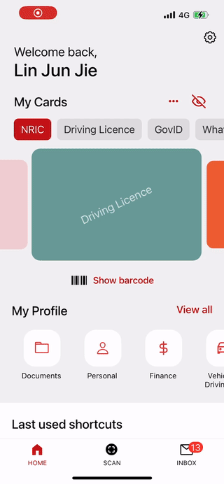
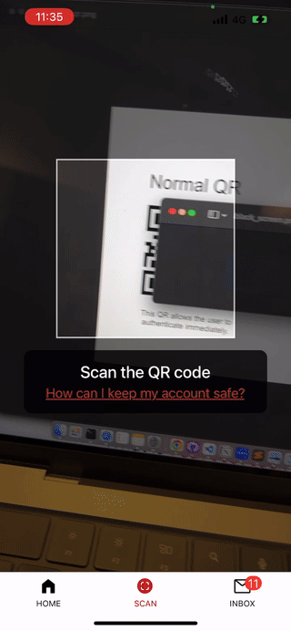
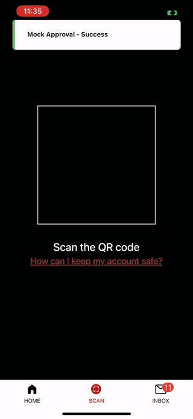
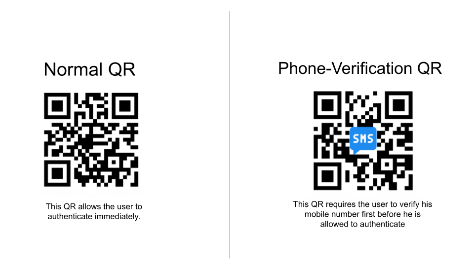
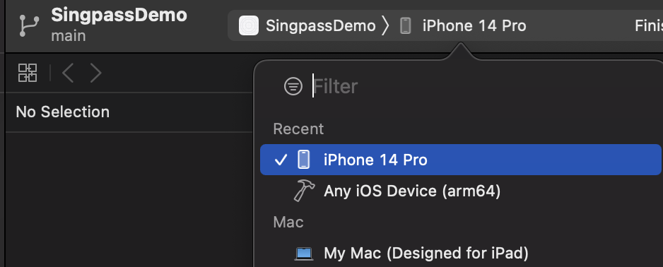
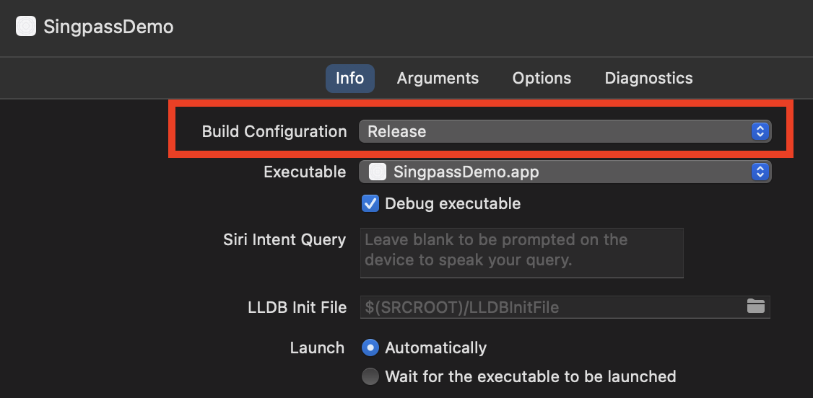
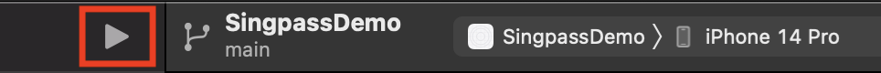
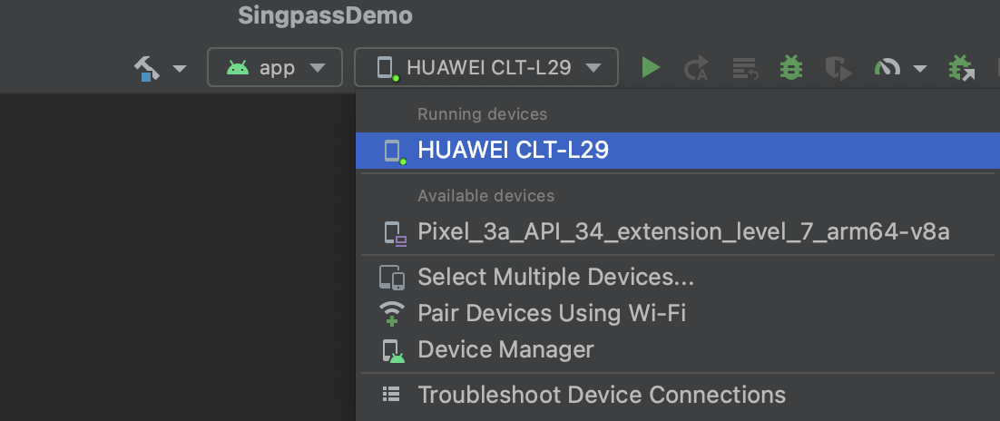
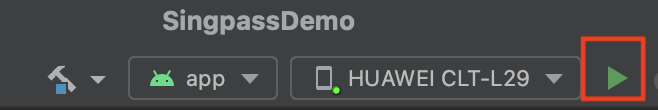

# Singpass App Prototype

This is a frontend React Native prototype to demostrate the Singpass App. It consists of the following features:

1. Home Page
2. QR Scanner
3. Gov Inbox

It doesn't have a backend.

| Home | Inbox |
| ---- | ----- |
|  |  |

| Scan QR (Normal) | Scan QR (Phone Verification) |
| ---- | ----- |
|  |  |

# Scan QR

Only the following 2 QR code works with the Scan function.

The QR code is located in `demo/qr.png`.

# Set up

1. Clone this project into your local directory.
2. In the project root, run `npm install`. This will install all the node_modules needed for the React Native project.
3. Run `cd ios && pod install`. This will install all the ios dependencies.

## Run on iOS

#### With Metro server (development):

Metro will serve the JavaScript bundle to the React Native app on the fly, allowing you the functionality of "Hot Reload", thereby speeding up development time.

1. Open Xcode > Xcode (Menu) > Open Developer Tools > Simulator. This will launch an iOS Simulator.
2. In project root, run `npm run start` and then press `i` to open on iOS simulator. This will run a metro server on your terminal and actively serves the file to your simulator.
3. To run the app on a physical iPhone, you can install the `Expo Go` app from the app store, then scan the QR code on the terminal.

#### Without Metro server:

To have the full app on your phone without needing a server on your terminal, you will need to build the entire app.

1. Open the file `ios/SingpassDemo.xcworkspace` in Xcode.
2. Plug your iPhone into the laptop. Trust your laptop.
3. Select your phone from the device dropdown. You may need to enable Developer Mode on your iPhone.

4. In the Menu, press Product > Scheme > Edit Scheme. Then choose `Release` as your Build Configuration.

5. Press the Run button to load the app onto your phone.

## Run on Android

Method 1 (easy):

1. Download Expo Go from the Playstore.
2. Run `npm run start`. This will start the metro server.
3. Scan the QR code in the terminal with the Expo Go.

Method 2:

1. Download `Android Studio` from android official website, then open it.
2. From `Android Studio`, open the file `android/build.gradle` from the project root.
3. Plug in your android phone to your computer. Turn on `Developer Option` on your phone, and turn on `USB Debugging`.
4. Select your phone from the device dropdown.

4. Run `npm run start`.
5. Press the run button on Android studio.

# Release

This is a prototype and not suitable for release.

# Notes

- No backend is present. No internet connection is needed. 
- When a user view or delete an Inbox message, the action is stored in asyncStorage locally on the user's device.
- After a user has scan the Phone verification QR, the QR is marked as read and stored in asyncStorage locally.
- Go to `Settings` on top right of Home Page, and click `Reset to default` to clear all local asyncStorage.
- No OTP will be sent. Type in any valid SG number. Type in any number for OTP.
- This is an Expo-managed app, and has not been ejected yet.